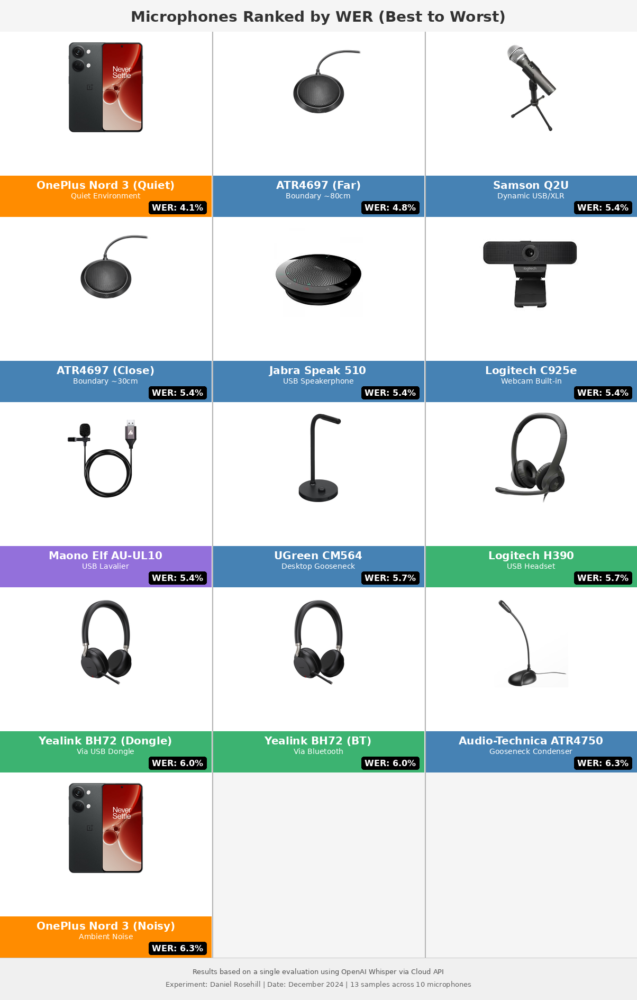

# Microphone Audio Samples for STT Evaluation



A benchmark comparing how different microphones affect speech-to-text (STT) accuracy. All samples use the same ~2-minute reference text about coffee history, recorded in a consistent home office environment.

## Purpose

This repository evaluates which microphones produce the best results for speech-to-text transcription by testing:

1. **Word Error Rate (WER)** - Accuracy of transcription against ground truth
2. **Audio Quality Score** - Technical quality metrics relevant to voice/STT applications

## Microphones Tested

| ID | Microphone | Type | Category | Connection | Notes |
|----|------------|------|----------|------------|-------|
| 1 | UGreen CM564 | USB Gooseneck | Desktop | USB-A | 30cm distance |
| 2 | Samson Q2U | Dynamic USB/XLR | Desktop | USB mini | 30cm distance |
| 3 | Logitech H390 | USB Headset | Headset | USB wired | Overhead mic |
| 4 | OnePlus Nord 3 5G | Smartphone built-in | Mobile | N/A | ASR HQ profile |
| 5 | OnePlus Nord 3 5G | Smartphone built-in | Mobile | N/A | Voicenotes.com (MP3) |
| 6 | Audio-Technica ATR4697 | Boundary Mic | Desktop | USB-A | 30cm distance |
| 7 | Audio-Technica ATR4697 | Boundary Mic | Desktop | USB-A | 80cm (long throw) |
| 8 | Jabra Speak 510 | USB Speakerphone | Desktop | USB | Conference device |
| 9 | Logitech C925e | Webcam built-in | Desktop | USB | 30cm distance |
| 10 | Maono Elf | Lavalier | Lavalier | USB-A | Wired lav |
| 11 | Yealink BH72 | Wireless Headset | Headset | USB Dongle | BT51 dongle |
| 12 | Yealink BH72 | Wireless Headset | Headset | Bluetooth | TP-Link UB500 |

## STT Evaluation Results

### Word Error Rate (WER) - Lower is Better

Tested with local Whisper large-v3-turbo and OpenAI Whisper API.

| Rank | Microphone | Category | Local Whisper WER | OpenAI Whisper WER |
|------|------------|----------|-------------------|-------------------|
| 1 | Maono Elf (lavalier) | Lavalier | **2.22%** | 5.40% |
| 2 | Jabra Speak 510 | Desktop | 3.17% | 5.40% |
| 3 | Logitech C925e (webcam) | Desktop | 3.49% | 5.40% |
| 4 | UGreen CM564 | Desktop | 3.81% | 5.71% |
| 5 | Audio-Technica ATR4697 (80cm) | Desktop | 4.13% | **4.76%** |
| 6 | Yealink BH72 (dongle) | Headset | 4.13% | 6.03% |
| 7 | OnePlus Nord 3 5G | Mobile | 5.08% | 5.71% |
| 8 | OnePlus Nord 3 5G (MP3) | Mobile | 6.03% | 5.40% |
| 9 | Audio-Technica ATR4697 (30cm) | Desktop | 6.35% | 5.40% |
| 10 | Logitech H390 | Headset | 6.98% | 5.71% |
| 11 | Samson Q2U | Desktop | 11.75% | 5.40% |
| 12 | Yealink BH72 (BT adapter) | Headset | 11.75% | 6.03% |

### Audio Quality Scores - Higher is Better

Quality score (0-100) based on technical audio metrics including SNR, dynamic range, clipping, and silence ratios.

| Rank | Microphone | Category | Quality Score | SNR (dB) | Dynamic Range (dB) |
|------|------------|----------|---------------|----------|-------------------|
| 1 | Yealink BH72 (dongle) | Headset | 85 | 37.2 | 58.1 |
| 2 | Yealink BH72 (BT) | Headset | 85 | 35.2 | 56.6 |
| 3 | OnePlus Nord 3 5G | Mobile | 84.5 | 26.1 | 44.2 |
| 4 | OnePlus Nord 3 5G (MP3) | Mobile | 83 | 27.5 | 46.1 |
| 5 | Samson Q2U | Desktop | 80 | 25.2 | 46.9 |
| 6 | Jabra Speak 510 | Desktop | 80 | 24.1 | 42.7 |
| 7 | Logitech C925e | Desktop | 75 | 16.6 | 38.7 |
| 8 | Maono Elf | Lavalier | 75 | 20.5 | 43.3 |
| 9 | Logitech H390 | Headset | 74 | 21.4 | 48.9 |
| 10 | UGreen CM564 | Desktop | 70 | 15.2 | 38.5 |
| 11 | Audio-Technica ATR4697 (30cm) | Desktop | 70 | 11.4 | 33.6 |
| 12 | Audio-Technica ATR4697 (80cm) | Desktop | 57 | 8.1 | 29.7 |

### Category Summary

| Category | Avg Quality Score | Avg WER (Local) | Best Performer |
|----------|-------------------|-----------------|----------------|
| Lavalier | 75.0 | **2.22%** | Maono Elf |
| Mobile | 83.8 | 5.56% | OnePlus Nord 3 |
| Desktop | 72.0 | 5.45% | Jabra Speak 510 |
| Headset | 81.3 | 7.62% | Yealink BH72 (dongle) |

## Key Findings

1. **Best for STT Accuracy**: The Maono Elf lavalier achieved the lowest WER (2.22%) with local Whisper, likely due to consistent proximity to the speaker.

2. **Audio Quality vs WER Mismatch**: Higher audio quality scores don't directly correlate with better STT accuracy. The Yealink BH72 had the highest quality score (85) but only mid-range WER.

3. **Distance Matters**: The Audio-Technica ATR4697 boundary mic at 80cm performed better for WER than at 30cm, possibly due to reduced proximity effects, though audio quality suffered.

4. **OpenAI vs Local Whisper**: OpenAI's Whisper API showed more consistent WER across samples (4.76-6.03%), while local Whisper varied more widely (2.22-11.75%).

5. **Bluetooth Considerations**: The same Yealink BH72 headset showed significantly worse WER (11.75%) when connected via generic Bluetooth adapter vs. its dedicated dongle (4.13%).

6. **MP3 Compression**: The voicenotes.com recording (MP3 compressed) performed slightly worse than the native WAV recording from the same phone.

## Methodology

- **Reference Text**: 315 words about coffee history (~2 minutes spoken)
- **Recording Environment**: Home office, quiet acoustic conditions
- **Recording Software**: Audacity (default for most samples)
- **STT Engines**:
  - Local Whisper large-v3-turbo (via Docker/ROCm)
  - OpenAI Whisper API (whisper-1)
- **Metrics**: Word Error Rate (WER), Character Error Rate (CER), audio analysis via ffprobe

## Repository Structure

```
.
├── samples/           # Audio recordings (WAV/MP3)
├── text/             # Reference text (coffee.txt)
├── metadata.json     # Recording metadata for each sample
├── evaluation_results.json  # Full evaluation data
├── evaluate.py       # Evaluation script
└── mynotes.md        # Personal notes
```

## License

Audio samples and evaluation data provided for research and comparison purposes.
