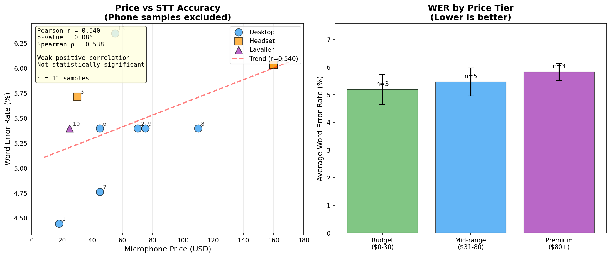

# Microphone Audio Samples for STT Evaluation

[](device-images/composites/eval-20251223/microphone-stt-benchmark.pdf)
[](device-images/composites/eval-20251223/infographic-wer-ranked.png)
[](device-images/composites/eval-20251223/microphones-by-category.png)
[](spectrograms/spectrograms_ranked_by_wer.png)
[](spectrograms/spectrograms_collection.pdf)
[](spectrograms/price_vs_wer_analysis.png)

---

## Key Takeaway

**Microphone quality matters less than environment for STT accuracy.** In this benchmark of 15 recordings across 10 microphones, most devices clustered within a narrow 4-6% Word Error Rate (WER) range. The biggest differentiator wasn't price or specifications—a $30 USB gooseneck mic matched or beat $150+ headsets. The same smartphone showed 50% higher error rates in a noisy market compared to a quiet room. For speech-to-text work, *any* decent microphone in a quiet space outperforms expensive gear in poor acoustic conditions.

All audio samples are **untreated raw recordings**—no noise reduction, normalization, or post-processing applied.

---

## Results (Single Transcription)


A benchmark comparing how different microphones affect speech-to-text (STT) accuracy. All samples use the same ~2-minute reference text about coffee history, recorded in a consistent home office environment.

## Purpose

This repository evaluates which microphones produce the best results for speech-to-text transcription by testing:

1. **Word Error Rate (WER)** - Accuracy of transcription against ground truth
2. **Audio Quality Score** - Technical quality metrics relevant to voice/STT applications

## Methodology

All transcriptions performed using OpenAI Whisper API (whisper-1) in a single evaluation session on 2025-12-23 to ensure methodological consistency.

- **Reference Text**: 315 words about coffee history (~2 minutes spoken)
- **Recording Environment**: Home office, quiet acoustic conditions
- **Recording Software**: Audacity (default for most samples)
- **Transcription**: OpenAI Whisper API (whisper-1)
- **Metrics**: Word Error Rate (WER), Character Error Rate (CER), audio analysis via ffprobe

## Microphones Tested

| ID | Microphone | Type | Category | Price (USD) | Notes |
|----|------------|------|----------|-------------|-------|
| 1 | UGreen CM564 | USB Gooseneck | Desktop | ~$18 | 30cm distance |
| 2 | Samson Q2U | Dynamic USB/XLR | Desktop | ~$70 | 30cm distance |
| 3 | Logitech H390 | USB Headset | Headset | ~$30 | Overhead mic |
| 4 | OnePlus Nord 3 5G | Smartphone built-in | Mobile | — | ASR HQ recording |
| 5 | OnePlus Nord 3 5G | Smartphone built-in | Mobile | — | Voicenotes.com (MP3) |
| 6 | Audio-Technica ATR4697 | Boundary Mic | Desktop | ~$45 | 30cm distance |
| 7 | Audio-Technica ATR4697 | Boundary Mic | Desktop | ~$45 | 80cm (long throw) |
| 8 | Jabra Speak 510 | USB Speakerphone | Desktop | ~$110 | Conference device |
| 9 | Logitech C925e | Webcam built-in | Desktop | ~$75 | 30cm distance |
| 10 | Maono Elf | Lavalier | Lavalier | ~$25 | Wired lav |
| 11 | Yealink BH72 | Wireless Headset | Headset | ~$160 | BT51 dongle |
| 12 | Yealink BH72 | Wireless Headset | Headset | ~$160 | TP-Link UB500 |
| 13 | Audio-Technica ATR4750-USB | Condenser Gooseneck | Desktop | ~$55 | Omnidirectional |
| 14 | OnePlus Nord 3 5G | Smartphone built-in | Mobile | — | Noisy (Mahane Yehuda) |
| 15 | OnePlus Nord 3 5G | Smartphone built-in | Mobile | — | Quiet (home office) |

## STT Evaluation Results

### Word Error Rate (WER) - Lower is Better

| Rank | ID | Microphone | Category | WER |
|------|-----|------------|----------|-----|
| 1 | 15 | OnePlus Nord 3 5G (quiet) | Mobile | **4.13%** |
| 2 | 1 | UGreen CM564 | Desktop | 4.44% |
| 3 | 7 | Audio-Technica ATR4697 (80cm) | Desktop | 4.76% |
| 4 | 2 | Samson Q2U | Desktop | 5.40% |
| 4 | 5 | OnePlus Nord 3 5G (MP3) | Mobile | 5.40% |
| 4 | 6 | Audio-Technica ATR4697 (30cm) | Desktop | 5.40% |
| 4 | 8 | Jabra Speak 510 | Desktop | 5.40% |
| 4 | 9 | Logitech C925e | Desktop | 5.40% |
| 4 | 10 | Maono Elf | Lavalier | 5.40% |
| 10 | 3 | Logitech H390 | Headset | 5.71% |
| 10 | 4 | OnePlus Nord 3 5G (HQ) | Mobile | 5.71% |
| 12 | 11 | Yealink BH72 (dongle) | Headset | 6.03% |
| 12 | 12 | Yealink BH72 (BT) | Headset | 6.03% |
| 12 | 14 | OnePlus Nord 3 5G (noisy) | Mobile | 6.03% |
| 15 | 13 | Audio-Technica ATR4750-USB | Desktop | 6.35% |

### Audio Quality Scores - Higher is Better

Quality score (0-100) based on technical audio metrics including SNR, dynamic range, clipping, and RMS levels.

| Rank | Microphone | Category | Quality Score |
|------|------------|----------|---------------|
| 1 | OnePlus Nord 3 5G (noisy) | Mobile | 89.0 |
| 2 | Yealink BH72 (dongle) | Headset | 85.0 |
| 2 | Yealink BH72 (BT) | Headset | 85.0 |
| 4 | OnePlus Nord 3 5G (HQ) | Mobile | 84.5 |
| 5 | OnePlus Nord 3 5G (MP3) | Mobile | 83.0 |
| 6 | Samson Q2U | Desktop | 80.0 |
| 6 | Jabra Speak 510 | Desktop | 80.0 |

### Category Summary

| Category | Avg Quality Score | Avg WER | Best Performer |
|----------|-------------------|---------|----------------|
| Desktop | 71.7 | 5.31% | UGreen CM564 (4.44%) |
| Mobile | 84.0 | 5.32% | OnePlus Nord 3 quiet (4.13%) |
| Lavalier | 75.0 | 5.40% | Maono Elf |
| Headset | 81.3 | 5.93% | Logitech H390 (5.71%) |

## Key Findings

1. **Best for STT Accuracy**: The OnePlus Nord 3 in a quiet environment achieved the lowest WER (4.13%), followed closely by the UGreen CM564 gooseneck (4.44%).

2. **Audio Quality vs WER Mismatch**: Higher audio quality scores don't directly correlate with better STT accuracy. The Yealink BH72 had the highest quality score (85) but only mid-range WER (6.03%).

3. **Environment Matters More Than Equipment**: The same OnePlus phone showed 4.13% WER in a quiet environment vs 6.03% in the noisy Mahane Yehuda market - a significant difference.

4. **Distance Affects Results**: The Audio-Technica ATR4697 boundary mic at 80cm outperformed the same mic at 30cm (4.76% vs 5.40%), possibly due to reduced proximity effects.

5. **Bluetooth Consistency**: Unlike some previous tests, both Yealink BH72 connection methods (dedicated dongle vs generic Bluetooth adapter) performed identically (6.03% WER).

6. **Most Microphones Perform Similarly**: The majority of microphones clustered around 5.40% WER, suggesting that for typical quiet office use, microphone choice has less impact than environmental factors.

## Price vs Accuracy Analysis



**Counter-intuitive finding: More expensive microphones showed slightly *worse* STT accuracy.**

| Price Tier | Samples | Avg WER | Best Performer |
|------------|---------|---------|----------------|
| Budget ($0-30) | 3 | 5.19% | UGreen CM564 (4.44%) |
| Mid-range ($31-80) | 5 | 5.46% | Audio-Technica ATR4697 (4.76%) |
| Premium ($80+) | 3 | 5.82% | Jabra Speak 510 (5.40%) |

**Correlation Statistics** (phone samples excluded, n=11):
- Pearson r = **0.540** (weak positive correlation—higher price, higher error rate)
- p-value = 0.086 (not statistically significant at α=0.05)

This suggests that for STT applications, expensive microphones don't provide meaningful accuracy benefits over budget options in quiet environments. The $18 UGreen gooseneck outperformed the $160 Yealink headset.

## Spectral Analysis

Spectrograms were generated for all 15 samples to visualize frequency characteristics and explore correlations with WER. All recordings are **untreated raw audio**—no noise reduction, normalization, or processing applied.


### Audio Feature Correlations

| Feature | Correlation with WER | Interpretation |
|---------|---------------------|----------------|
| Spectral Bandwidth | r = -0.516 (p=0.049) | Wider bandwidth → lower error rate |
| Harmonic Ratio | r = -0.443 (p=0.098) | Cleaner voice signal → lower error rate |
| Speech Clarity Ratio | r = +0.393 (p=0.147) | Complex relationship |

Individual spectrograms for each microphone are available in the [spectrograms/](spectrograms/) directory, showing:
- Full frequency spectrum (0-8kHz, speech range)
- Mel spectrogram (perceptual frequency scale)
- Spectral features over time (centroid, rolloff)
- Key audio metrics (harmonic ratio, speech band energy)

## Repository Structure

```
.
├── samples/                    # Audio recordings (WAV/MP3)
├── text/                       # Reference text (coffee.txt)
├── metadata.json               # Recording metadata for each sample
├── evaluation_results.json     # Full evaluation data
├── evaluate.py                 # Evaluation script
├── generate_spectrograms.py    # Spectrogram & audio feature analysis
├── price_analysis.py           # Price vs WER correlation analysis
├── device-images/
│   ├── originals/              # Microphone product photos
│   └── composites/             # Generated graphics
├── spectrograms/               # Audio analysis outputs
│   ├── spectrogram_*.png       # Individual spectrograms per sample
│   ├── spectrograms_collection.pdf  # All spectrograms in PDF (landscape)
│   ├── spectrograms_ranked_by_wer.png
│   ├── correlation_analysis.png
│   ├── price_vs_wer_analysis.png
│   ├── analysis_report.md      # Detailed analysis findings
│   └── audio_features.csv      # Extracted features data
└── microphones/                # Detailed microphone documentation
```

## Downloads

- [PDF Report](device-images/composites/eval-20251223/microphone-stt-benchmark.pdf) - Complete visual benchmark report
- [Spectrograms PDF Collection](spectrograms/spectrograms_collection.pdf) - All 18 spectrograms in landscape format (one per page)
- [Spectrograms Grid](spectrograms/spectrograms_ranked_by_wer.png) - All 15 spectrograms ranked by WER
- [Price Correlation Chart](spectrograms/price_vs_wer_analysis.png) - Price vs accuracy analysis
- [Audio Feature Correlations](spectrograms/correlation_analysis.png) - Feature correlation scatter plots
- [Analysis Report](spectrograms/analysis_report.md) - Detailed audio feature analysis findings
- [Audio Features CSV](spectrograms/audio_features.csv) - Raw extracted audio features data

## License

Audio samples and evaluation data provided for research and comparison purposes.
